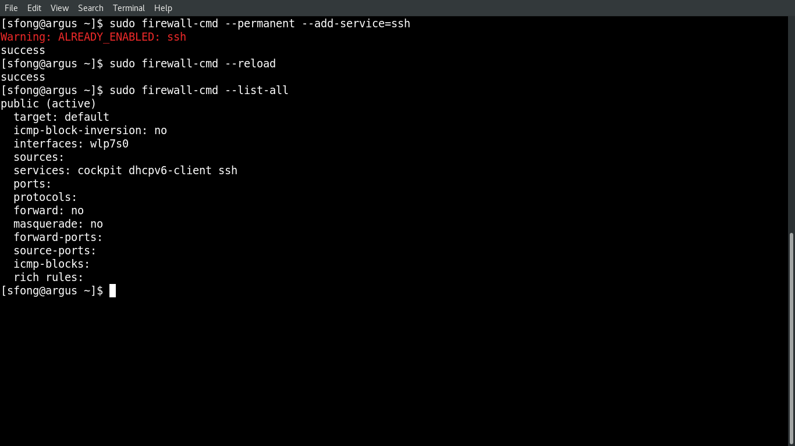
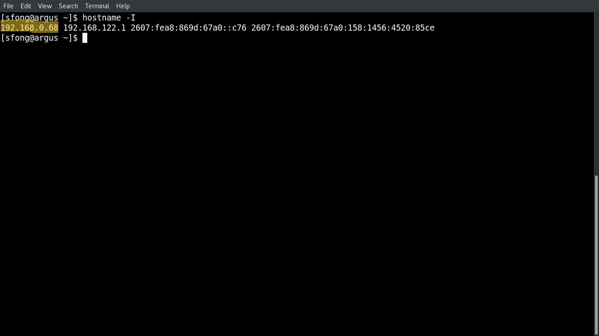
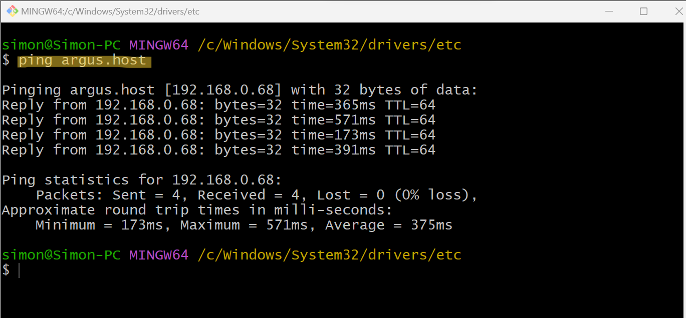
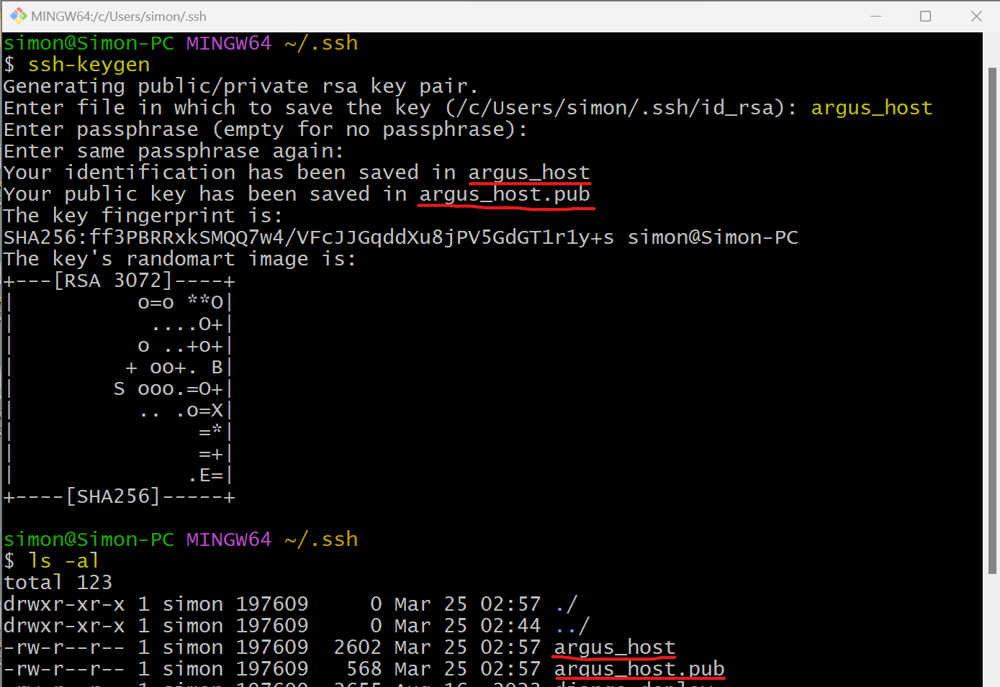
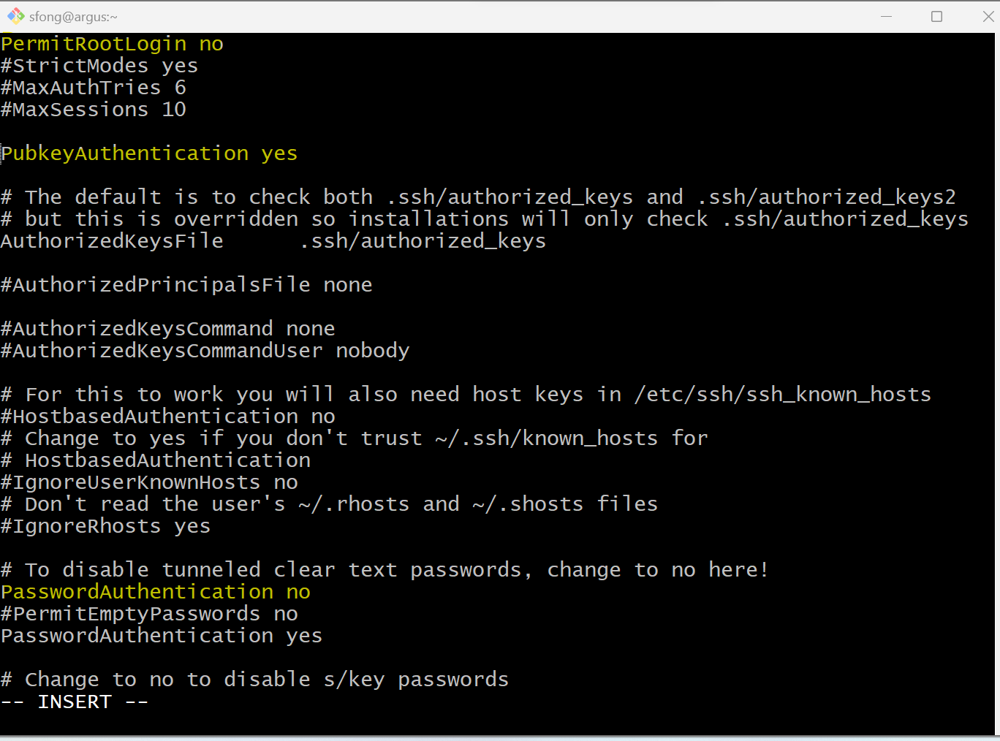

# Home Lab Server(Part 2) - `SSH` Connection On Oracle Linux

[Back](../../../README.md)

- [Home Lab Server(Part 2) - `SSH` Connection On Oracle Linux](#home-lab-serverpart-2---ssh-connection-on-oracle-linux)
  - [`openssh-server`](#openssh-server)
  - [Create a SSH using password authentication](#create-a-ssh-using-password-authentication)
    - [Server side](#server-side)
    - [Client](#client)
  - [Enable Key-pair Authentication](#enable-key-pair-authentication)

---

## `openssh-server`

- `openssh-server`
  - a suite of **network connectivity tools** that provides secure communications between systems.
- The tools include:

  - `scp` - Secure file copying. (Deprecated in Oracle Linux 9)
  - `sftp` - Secure **File Transfer** Protocol (FTP).
  - `ssh` - Secure shell to log on to or run a command on a remote system.
  - `sshd` - **Daemon** that listens for the OpenSSH services.
  - `ssh-keygen` - Creates RSA authentication **keys**.

- Doc:
  - https://docs.oracle.com/en/operating-systems/oracle-linux/openssh/openssh-AboutOpenSSH.html#about-openssh

---

## Create a SSH using password authentication

### Server side

```sh
# list packages to verify installation
dnf list installed | grep ssh

sudo systemctl start sshd   # start deamon
```


---

- Disable root

```sh
sudo vi /etc/ssh/sshd_config
```

```conf
PermitRootLogin no
```


- Update deamon

```sh
sudo systemctl restart sshd   # restart deamon after new configuration
sudo systemctl status sshd
```


- Update firewall

```sh
sudo firewall-cmd --permanent --add-service=ssh
sudo firewall-cmd --reload
sudo firewall-cmd --list-all
```



- Get the IP address



---

### Client

- OS: Window
- Terminal: Git bash

- Configure hosts on Client




```sh
# verify ssh
ssh -V
# OpenSSH_9.1p1, OpenSSL 1.1.1s  1 Nov 2022

ssh user_name@ip_address -p 22
```


---

## Enable Key-pair Authentication

- Client:
  - Create private key + public key
  - Keep the private key
- Server:
  - Keep the public key
  - Verfity the private key of a connection request
  - path of copied public key:
    - `~/.ssh.authorized_keys`

---

- Client Side

```sh
ssh-keygen    # generate rsa key pair

ls -al ~/.ssh   # confirm
```



```sh
ssh-copy-id -i ~/.ssh/key_file.pub user_name@ip_address   # copy pulic key to server side

# Connect to the remove server using key-pair
ssh user_name@ip_address -i ~/.ssh/key_file
```


---

- Disable password authentication after enabling key-paire authentication

```sh
sudo vi /etc/ssh/sshd_config
```

```conf
PasswordAuthentication no
PubkeyAuthentication yes
```



---

- Restart deamon and exit the current session
  - Reconnect to the remote server using password
    - Connect deney
  - Reconnect to the remote server using key-pair
    - Connect success

```sh
sudo systemctl restart sshd
exit

ssh user_name@ip_address
# permission denied

ssh user_name@ip_address -i ~/.ssh/key_file
# success
```


---

[TOP](#home-lab-serverpart-2---ssh-connection-on-oracle-linux)
